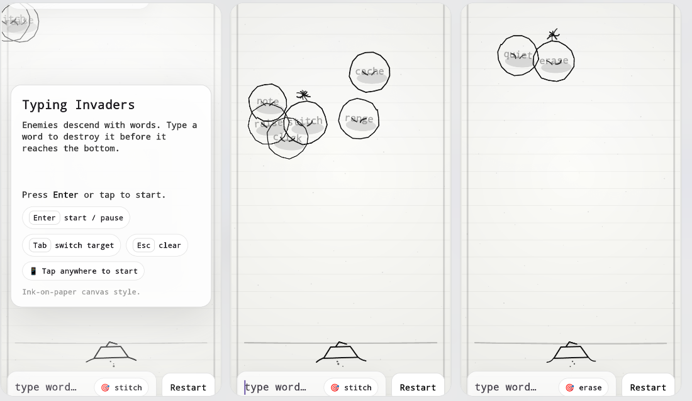

# 🎮 Typing Invaders

A real-time arcade-style typing game built with Flutter, where players must type words accurately and quickly to destroy incoming enemies.

---

## 📌 Overview

**Typing Invaders** blends classic space-invader mechanics with typing speed challenges. The player must eliminate enemies by correctly typing displayed words before they reach the bottom of the screen.

This project demonstrates:
- Real-time UI rendering in Flutter
- Game loop architecture in Dart
- Input handling and state synchronization
- Performance optimization for animations

---

## UI mockups


- ⌨️ Real-time typing detection
- 👾 Dynamic enemy spawning system
- ⚡ Progressive difficulty scaling
- 🎯 Score tracking and accuracy metrics
- 🔄 Game loop with frame updates
- 📱 Cross-platform support (Android, iOS, Web)

---

## 🏗️ Architecture


### Key Design Patterns

- **State-driven UI (Flutter reactive model)**
- **Game Loop Simulation using Timer / Ticker**
- **Separation of Concerns (UI vs Game Logic)**

---

## ⚙️ Tech Stack

- **Framework:** Flutter
- **Language:** Dart
- **Rendering:** Custom widget-based rendering
- **State Management:** (implicit / setState or lightweight approach)

---

## 📊 Case Studies

### 1. Real-Time Input Handling

**Context**  
Typing Invaders relies on rapid, continuous keyboard input to destroy enemies. Any lag, dropped keystrokes, or delayed UI updates directly impacts gameplay quality.

**Problem**  
- High-frequency input events caused inconsistent detection  
- UI rebuilds introduced latency  
- Risk of missed or misordered keystrokes under load  

**Solution**  
- Implemented a buffered input system to track user keystrokes incrementally  
- Compared typed input against active enemy words using efficient string matching  
- Isolated input handling logic from UI rendering to prevent unnecessary rebuilds  
- Used lightweight state updates instead of full widget tree refreshes  

**Result**  
- Accurate keystroke recognition under high-speed typing  
- Reduced input latency  
- Smooth and responsive gameplay experience  

---

### 2. Game Loop Optimization in Flutter

**Context**  
Flutter is not a traditional game engine, so managing real-time updates requires manual control over rendering cycles.

**Problem**  
- Lack of native game loop abstraction  
- Frequent updates led to performance bottlenecks  
- Frame drops during heavy gameplay  

**Solution**  
- Implemented a controlled game loop using `Ticker` / `Timer`  
- Decoupled game logic updates from rendering  
- Batched state updates to reduce unnecessary frame work  
- Limited redraw scope to only affected widgets  

**Result**  
- Stable frame rate during gameplay  
- Predictable update cycles  
- Improved performance across mid-range devices  

---

### 3. Dynamic Difficulty Scaling

**Context**  
Maintaining player engagement requires a balance between challenge and playability.

**Problem**  
- Static difficulty leads to boredom or frustration  
- Early gameplay too easy, later gameplay too abrupt  

**Solution**  
- Introduced progressive enemy spawn rates  
- Increased word complexity over time  
- Adjusted enemy movement speed based on score thresholds  
- Tuned difficulty curve through iterative playtesting  

**Result**  
- Smooth difficulty progression  
- Increased player retention  
- More engaging long-session gameplay  

---

### 4. UI Rendering Performance

**Context**  
Frequent updates to enemy positions and text elements can cause UI jank in Flutter.

**Problem**  
- Excessive widget rebuilds  
- Deep widget tree causing rendering overhead  
- Frame drops during intense gameplay  

**Solution**  
- Used `const` constructors where possible  
- Flattened widget hierarchy to reduce render cost  
- Isolated animated components into smaller widgets  
- Minimized state changes to only necessary elements  

**Result**  
- Smooth animations and transitions  
- Reduced frame drops  
- Consistent rendering performance  

---

### 5. Separation of Game Logic and UI

**Context**  
Scalability and maintainability require clear separation between logic and presentation layers.

**Problem**  
- Tight coupling between UI and game logic  
- Harder debugging and feature expansion  

**Solution**  
- Structured project into:
  - `logic/` → game rules and mechanics  
  - `models/` → data representation  
  - `ui/` → rendering and interaction  
- Ensured UI reacts to state instead of controlling it  

**Result**  
- Improved code maintainability  
- Easier feature extension (e.g., multiplayer, leaderboards)  
- Cleaner architecture aligned with best practices  

---
## ▶️ Getting Started

### Prerequisites

- Flutter SDK installed
- Dart SDK
- Android Studio / VS Code

### Installation

```bash
git clone https://github.com/simonchitepo/typing-invaders.git
cd typing-invaders
flutter pub get
flutter run
